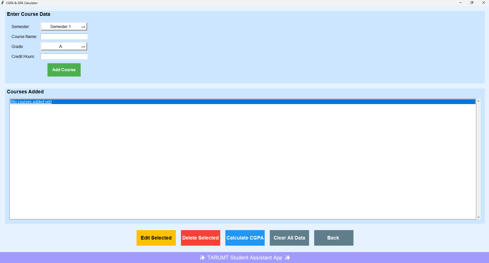
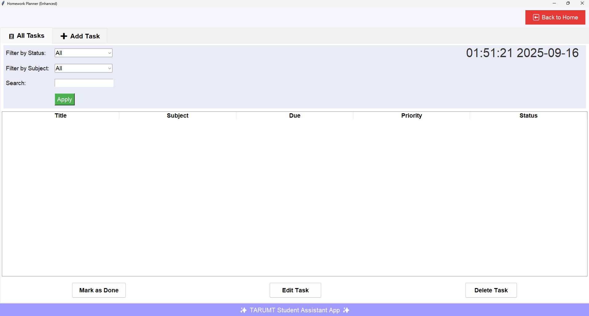
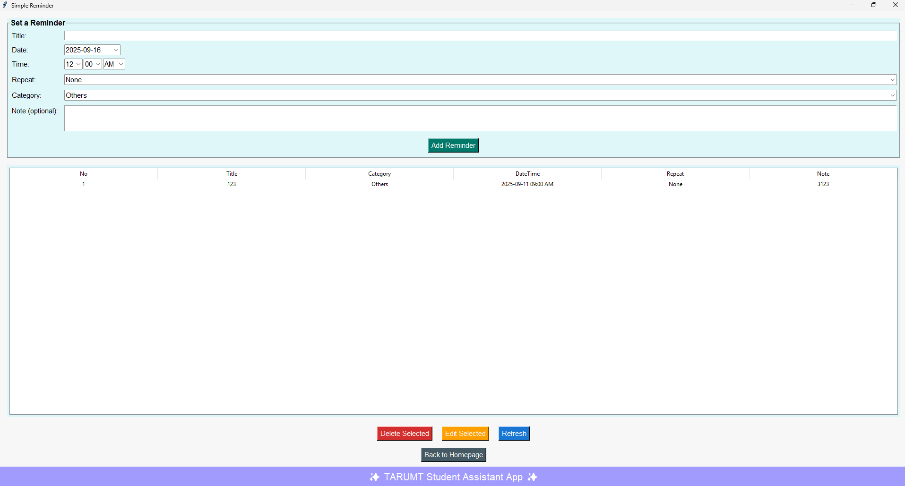

# Python-Asm

Python-Asm is a TARUMT Student Assistant App developed as an assignment project by a team of three members. The app is designed to help students manage their academic life more efficiently by providing three core utilities:

- **CGPA & GPA Calculator**
- **Homework Planner**
- **Simple Reminder**

---

## Table of Contents

- [Features](#features)
- [Screenshots](#screenshots)
- [Installation](#installation)
- [Usage](#usage)
- [Technologies Used](#technologies-used)
- [Contributing](#contributing)
- [Authors](#authors)
- [License](#license)

---

## Features

- **Easy to Install:** Quick setup for all users.
- **Beginner-Friendly:** Simple UI and workflow for students.
- **CGPA & GPA Calculator:** Calculate your CGPA and GPA based on your grades.
- **Homework Planner:** Organize and track assignments with deadlines.
- **Simple Reminder:** Set up reminders for important academic and personal tasks.

---

## Screenshots

_Add screenshots here to showcase the app UI and main features. Example:_





---

## Installation

1. **Clone this repository:**
   ```bash
   git clone https://github.com/tt041217/Python-Asm.git
   ```
2. **Navigate to the project directory:**
   ```bash
   cd Python-Asm
   ```
3. **Install dependencies:**  
   _If applicable, list required packages, e.g.:_
   ```bash
   pip install -r requirements.txt
   ```
4. **Run the app:**  
   _Add instructions for running the project, e.g.:_
   ```bash
   python main.py
   ```

---

## Usage

- **CGPA & GPA Calculator:**  
  Enter your grades and credits to compute your CGPA and GPA.
- **Homework Planner:**  
  Add, edit, and delete homework tasks. Track deadlines and completion.
- **Simple Reminder:**  
  Set up reminders for classes, exams, meetings, and more. Get notified on time.

---

## Technologies Used

- Python 3.x
- Tkinter (for GUI)
- OS
- Json
- PIL
- Datetime

---

## Contributing

Contributions are welcome! If you'd like to improve this project, follow these steps:

1. Fork the repository.
2. Create your feature branch (`git checkout -b feature/AmazingFeature`).
3. Commit your changes (`git commit -m 'Add some AmazingFeature'`).
4. Push to the branch (`git push origin feature/AmazingFeature`).
5. Open a Pull Request.

---

## Authors

- **Member 1:** [Chai Kah Quan](https://github.com/tt041217)
- **Member 2:** [Tan Ting Hng](https://github.com/tth-git)
- **Member 3:** [Ang Zhi Yee](https://github.com/ANG-447)

---

## License

This project is licensed under the [MIT License](LICENSE).

---

## Acknowledgements

- TARUMT Faculty for guidance
- Python & Tkinter documentation
- Open-source libraries and contributors
